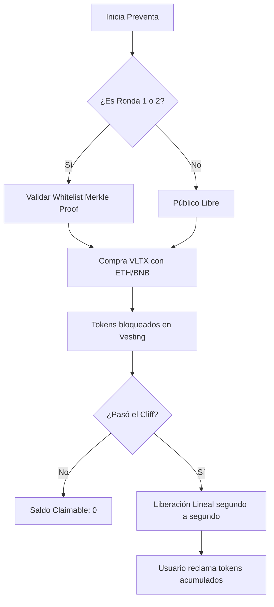
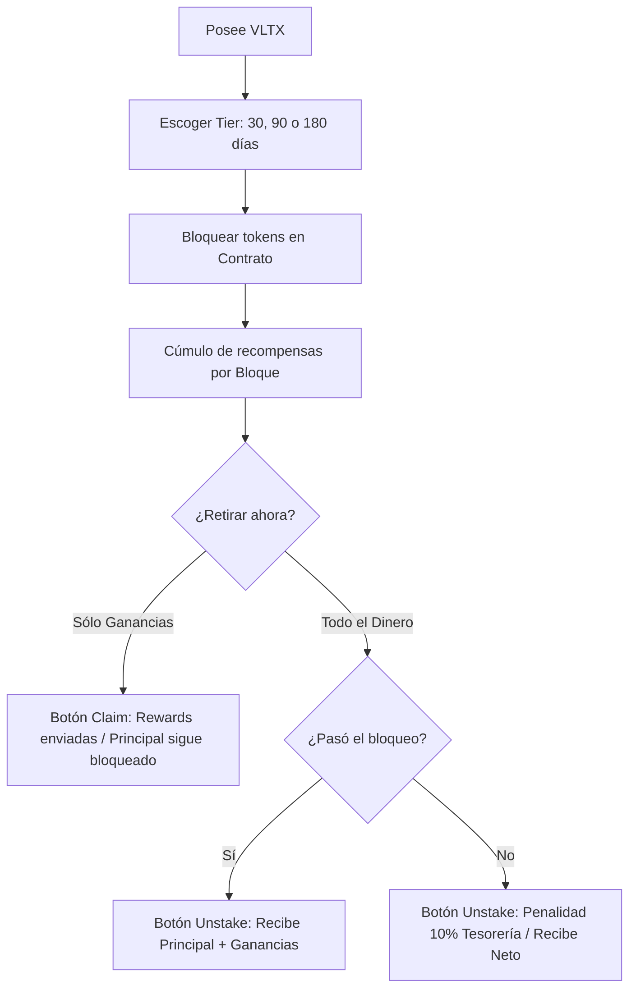

# Documentación Técnica de VaultX 🚀

Este documento sirve como guía completa de la arquitectura, lógica e instalación de la **DApp VaultX**, diseñada específicamente para la evaluación de pruebas técnicas.

---

## 1. Stack Tecnológico 🛠️

*   **Smart Contracts**: Solidity ^0.8.20 (SafeMath nativo, Ownable, ReentrancyGuard).
*   **Blockchain Dev**: Hardhat + Viem (reemplazo moderno para Ethers en pruebas).
*   **Frontend**: React 18 + Vite + TypeScript.
*   **Motor UI/UX**: Material UI (MUI) para componentes profesionales.
*   **Arquitectura de Estilos**: **SCSS Modules** siguiendo la metodología **BEM (Block Element Modifier)** y funciones de utilidad personalizadas `pixelToRem`.
*   **Integración Web3**: Ethers.js v6 + Web3-React.

---

## 2. Arquitectura de Smart Contracts 🧠

### A. VaultXToken (VLTX)
Un token ERC20 estándar que impulsa el ecosistema.
*   **Suministro Total**: 1,000,000,000 VLTX.
*   **Emisión**: Todos los tokens se acuñan al desplegador en la creación para facilitar la preventa y la asignación de recompensas.

### B. PresaleVault.sol
Gestiona la fase de recaudación de fondos con una lógica de liberación (vesting) avanzada.
*   **Lógica de Rondas**: Soporta 3 rondas distintas (`Pre-Seed`, `Seed`, `Public`) con precios dinámicos.
*   **Lista Blanca (Whitelisting)**: Implementa **Merkle Tree Proofs** para la verificación eficiente y sin gasto de gas fuera de la cadena (solo Rondas 1 y 2).
*   **Vesting (Liberación Lineal)**:
    *   **Periodo Cliff**: Un periodo inicial donde no se pueden reclamar tokens.
    *   **Liberación Lineal**: Los tokens se liberan proporcionalmente según el tiempo transcurrido después del cliff hasta la duración total (ej. 6 meses).
*   **Seguridad**: Previene el doble reclamo y maneja la moneda nativa (ETH/BNB) de forma segura usando `ReentrancyGuard`.

### C. VaultXStaking.sol
El motor principal para la retención de usuarios y recompensas.
*   **Devengo por Bloque**: Las recompensas se calculan usando `block.number`, asegurando la precisión incluso si los tiempos de bloque varían ligeramente.
*   **Multiplicadores por Nivel**: 
    *   30 Días: **1.0x**
    *   90 Días: **1.5x**
    *   180 Días: **2.0x**
*   **Penalización por Salida Temprana**: Se aplica una **comisión del 10%** si un usuario retira sus fondos antes de que termine el bloqueo. Estos fondos van a la **Tesorería** del proyecto.
*   **Basado en Posiciones**: Cada stake es una estructura única ("Posición"), lo que permite a los usuarios tener múltiples stakes independientes con diferentes niveles.

---

## 3. Arquitectura Frontend (React) ⚛️

### Metodología: BEM + SCSS Modules
Los componentes se estilizan usando SCSS anidado para asegurar un JSX limpio y alcances de CSS aislados.
*   **Block**: `.presale`
*   **Element**: `.presale-header`
*   **Modifier**: `.presale-button--active`

### Hooks y Gestión de Estado:
*   **`useWeb3React`**: Maneja la conectividad de la billetera, cambios de cuenta y cambio de red (especializado en Ganache).
*   **`usePresale`**: Se conecta a un `JsonRpcProvider` para lecturas ultrarrápidas y a un `BrowserProvider` para transacciones.
*   **`useStaking`**: Sincroniza las posiciones de staking, calcula las recompensas pendientes en tiempo real en el frontend y gestiona los flujos de aprobación/stake.

### Motor de Configuración (`.env`)
Todas las constantes críticas están centralizadas en el archivo `.env` raíz para facilitar el cambio entre desarrollo local y producción.

---

## 4. Ejecución y Scripts 📜

### Despliegue
Utiliza **Hardhat Ignition** para el despliegue declarativo:
```bash
npx hardhat ignition deploy ./ignition/modules/Presale.ts --network ganache
npx hardhat ignition deploy ./ignition/modules/Staking.ts --network ganache
```

### Scripts de Ayuda
*   **`distribute-tokens.ts`**: Alimenta el contrato de Staking con tokens de recompensa y proporciona VLTX a las cuentas de prueba.
*   **`activate-round.ts`**: Control de administrador para alternar entre las rondas Pre-Seed, Seed y Pública.
*   **`simulate-presale-launch.ts`**: Simula el paso de 60 días en la blockchain para probar la funcionalidad de **Reclamo de Vesting** inmediatamente.

---

## 5. Seguridad y Optimización de Gas ⚡

1.  **Gas < 150k**: La lógica refinada de `buyTokens()` asegura que el consumo de gas se mantenga muy por debajo de las 150,000 unidades mediante el uso de variables `immutable` y minimizando las escrituras en almacenamiento.
2.  **Seguridad Aritmética**: Utiliza la protección nativa contra desbordamiento (overflow) de Solidity 0.8+.
3.  **Protección contra Reentrada**: Cada función que transfiere fondos o tokens está protegida contra ataques de reentrada.
4.  **Precisión Matemática**: Todos los cálculos usan precisión de `1e18` (wad) para prevenir errores de redondeo en la tokenómica.

---

## 6. Diagramas de Flujo de Procesos 📊

### A. Ciclo de Vida del Inversor (Preventa)


### B. Ciclo de Vida del Staking (Recompensas)


---

## 7. Glosario Técnico 📖

*   **Vesting**: Periodo durante el cual los tokens están bloqueados y se liberan gradualmente para asegurar la estabilidad económica del proyecto.
*   **Cliff**: Retraso inicial antes de que el Vesting comience a liberar tokens. Durante este tiempo, el saldo reclamable es 0.
*   **Merkle Tree/Proof**: Una estructura de datos criptográfica que permite validar si un inversor está en una lista blanca sin guardar toda la lista en la blockchain.
*   **Staking**: El acto de bloquear criptomonedas en un smart contract para recibir intereses/recompensas.
*   **Reentrancy**: Un ataque común donde un hacker intenta llamar a una función de contrato múltiples veces antes de que la primera termine. Usamos `ReentrancyGuard` para evitarlo.
*   **Multiplicador**: Un factor (ej. 1.5x, 2.0x) que aumenta las recompensas proporcionalmente a la duración del periodo de bloqueo.
*   **WAD / precisión**: Escalamiento matemático (usualmente 18 decimales) para prevenir errores de redondeo.

---
**VaultX - Guía de Evaluación Técnica**
