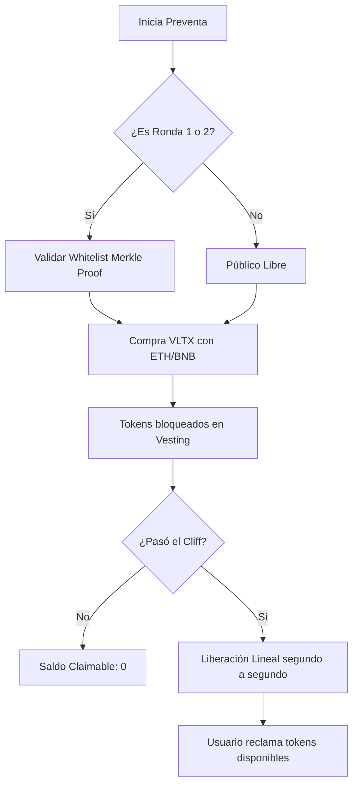
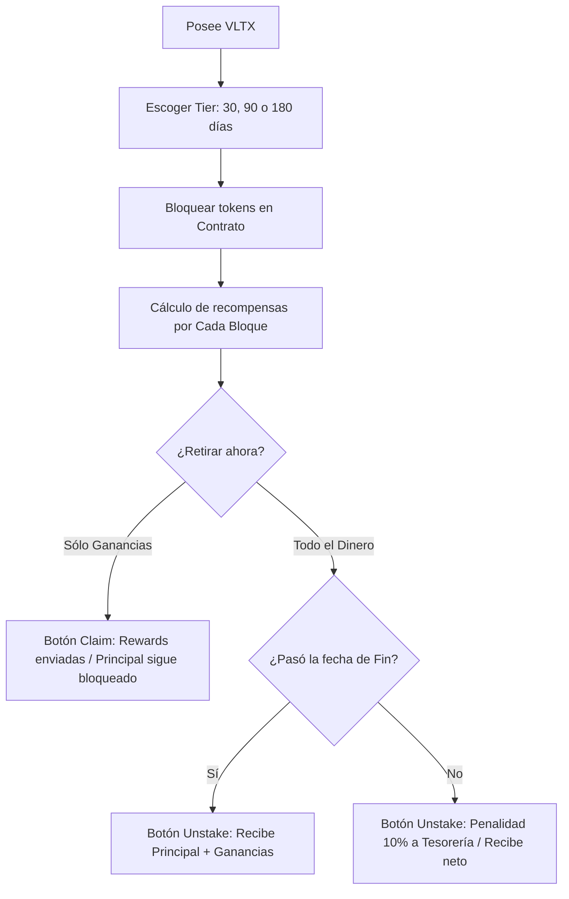

# VaultX Technical Documentation 🚀

This document serves as a comprehensive guide to the **VaultX DApp** architecture, logic, and installation, designed specifically for technical test assessment.

---

## 1. Technical Stack 🛠️

*   **Smart Contracts**: Solidity ^0.8.20 (SafeMath native, Ownable, ReentrancyGuard).
*   **Blockchain Dev**: Hardhat + Viem (modern replacement for Ethers in testing).
*   **Frontend**: React 18 + Vite + TypeScript.
*   **UI/UX Engine**: Material UI (MUI) for professional components.
*   **Styling Architecture**: **SCSS Modules** following **BEM (Block Element Modifier)** methodology and custom `pixelToRem` utility functions.
*   **Web3 Integration**: Ethers.js v6 + Web3-React.

---

## 2. Smart Contract Architecture 🧠

### A. VaultXToken (VLTX)
A standard ERC20 token that powers the ecosystem.
*   **Total Supply**: 1,000,000,000 VLTX.
*   **Minting**: All tokens are minted to the deployer at inception to facilitate the presale and rewards allocation.

### B. PresaleVault.sol
Manages the fundraising phase with advanced vesting logic.
*   **Round Logic**: Supports 3 distinct rounds (`Pre-Seed`, `Seed`, `Public`) with dynamic prices.
*   **Whitelisting**: Implements **Merkle Tree Proofs** for efficient, gas-less off-chain whitelist verification (Round 1 & 2 only).
*   **Vesting (Linear Drop)**:
    *   **Cliff Period**: An initial period where no tokens can be claimed.
    *   **Linear Release**: Tokens are released proportionally based on time passed after the cliff until the full duration (e.g., 6 months).
*   **Security**: Prevents double-claiming and handles native currency (ETH/BNB) safely.

### C. VaultXStaking.sol
The core engine for user retention and rewards.
*   **Per-Block Accrual**: Rewards are calculated using `block.number`, ensuring accuracy even if block times vary slightly.
*   **Tier Multipliers**: 
    *   30 Days: **1.0x**
    *   90 Days: **1.5x**
    *   180 Days: **2.0x**
*   **Early Exit Penalty**: A **10% fee** is applied if a user unstakes before the lock ends. These funds go to the project **Treasury**.
*   **Position Based**: Each stake is a unique "Position" struct, allowing users to have multiple independent stakes with different tiers.

---

## 3. Frontend Architecture (React) ⚛️

### methodology: BEM + SCSS Modules
Components are styled using nested SCSS to ensure clean JSX and isolated CSS scopes.
*   **Block**: `.presale`
*   **Element**: `.presale-header`
*   **Modifier**: `.presale-button--active`

### Hooks & State Management:
*   **`useWeb3React`**: Handles wallet connectivity, account changes, and network switching (Ganache specialized).
*   **`usePresale`**: Connects to a `JsonRpcProvider` for lighting-fast reads (to avoid MetaMask lag) and a `BrowserProvider` for transactions.
*   **`useStaking`**: Syncs staking positions, calculates pending rewards in real-time on the frontend, and manages approval/stake flows.

### Config Engine (`.env`)
All critical constants are centralized in the root `.env` file for easy switching between local development and production.

---

## 4. Execution & Scripts 📜

### Deployment
Uses **Hardhat Ignition** for declarative deployment:
```bash
npx hardhat ignition deploy ./ignition/modules/Presale.ts --network ganache
npx hardhat ignition deploy ./ignition/modules/Staking.ts --network ganache
```

### Helper Scripts
*   **`distribute-tokens.ts`**: Feeds the Staking contract with reward tokens and provides VLTX to testing accounts.
*   **`activate-round.ts`**: Admin control to switch between Pre-Seed, Seed, and Public rounds.
*   **`simulate-presale-launch.ts`**: Simulates the passage of 60 days on the blockchain to test the **Vesting Claim** functionality immediately.

---

## 5. Security & Gas Optimization ⚡

1.  **Gas < 150k**: Refined `buyTokens()` logic ensures gas consumption stays well below 150,000 units by using `immutable` variables and minimizing storage writes.
2.  **Arithmetic Safety**: Uses Solidity 0.8+ native overflow protection.
3.  **Reentrancy Guard**: Every function transferring funds or tokens is protected against re-entry attacks.
4.  **Mathematical Precision**: All calculations use `1e18` (wad) precision to prevent rounding errors in tokenomics.

---

## 6. Fluxogramas de Procesos (Visual Study Guide) 📊

### A. Ciclo de Vida del Inversor (Preventa)


### B. Ciclo de Vida del Staking (Recompensas)


---

## 7. Glosario Técnico (Términos que debes conocer) 📖

*   **Vesting**: Periodo de tiempo en el que los tokens están "bloqueados" y se entregan poco a poco para proteger la salud económica del proyecto.
*   **Cliff**: Tiempo de espera inicial antes de que el Vesting empiece a entregar tokens. Durante el Cliff, el saldo es 0.
*   **Merkle Tree/Proof**: Estructura de datos criptográfica que permite validar si alguien está en una lista blanca sin guardar toda la lista en la blockchain.
*   **Staking**: El acto de bloquear tus criptomonedas para recibir recompensas intereses a cambio de no moverlas.
*   **Reentrancy**: Un tipo de ataque donde un hacker intenta llamar a una función de contrato muchas veces antes de que se termine la primera llamada. Nosotros usamos `ReentrancyGuard` para evitarlo.
*   **Multiplicador**: Un factor (como 1.5x o 2.0x) que aumenta tus ganancias proporcionalmente al tiempo que te comprometes a no retirar.
*   **WAD / precision**: Usar 18 decimales en las matemáticas del contrato para evitar errores de redondeo.

---
**VaultX - Guía de Estudio Rápida**
